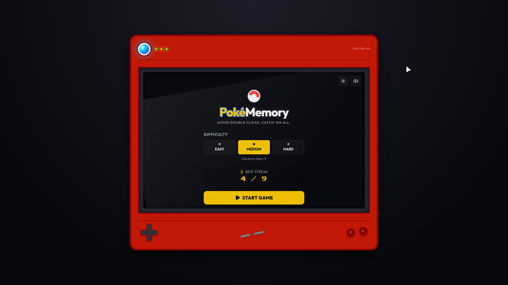
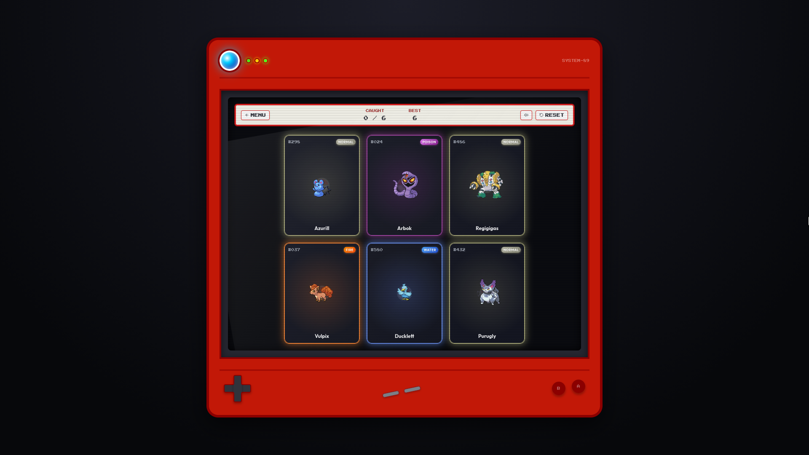
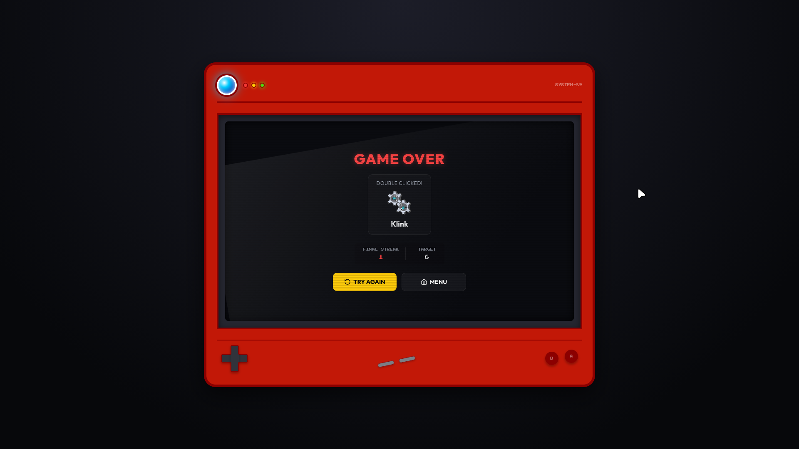
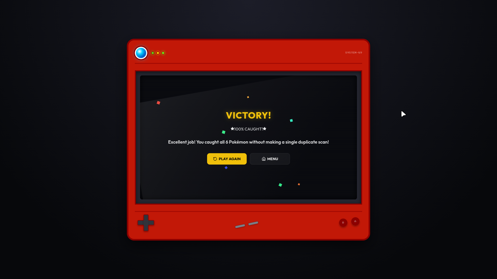

#  PokéMemory

**PokéMemory** is a premium, high-fidelity retro memory-avoidance game built with **React**, **Vite**, and **Vanilla CSS**. Step into a nostalgic, skeuomorphic console and test your memory against a shifting grid of classic Pokémon.

  

---

### 🎮 The Gameplay
Unlike traditional card-matching memory games, PokéMemory is a **memory-avoidance challenge**:
1. You are presented with a grid of unique Pokémon cards.
2. Clicking a card flips the board, shuffles the deck, and redeals it.
3. Your goal is to click **every card exactly once** without selecting the same Pokémon twice.
4. Win by successfully selecting all cards in the deck!

---

### 📸 Previews

<table width="100%">
  <tr>
    <td width="50%" align="center">
      <b>Console Menu</b> 
      
    </td>
    <td width="50%" align="center">
      <b>Active Gameplay</b> 
      
    </td>
  </tr>
  <tr>
    <td width="50%" align="center">
      <b>Game Over Screen</b> 
      
    </td>
    <td width="50%" align="center">
      <b>Victory Screen</b> 
      
    </td>
  </tr>
</table>

---

### ✨ Features

* **Skeuomorphic Retro Consoles**  
  * **Dark Mode**: Styled after a sleek, interactive PokéDex console with dynamic LED status lights, screen glare filters, and CRT scanlines.
  * **Light Mode**: Reimagined as the classic grey Game Boy DMG console.
* **FireRed Parchment HUD**  
  * Scoreboard framed exactly like the classic Pokémon FireRed text box dialogues, featuring a cream parchment background and terracotta bordered trims. Responsive icon-only scaling on mobile prevents layout overflow.
* **Dynamic Chiptune Synthesizer**  
  * Audio tracks and sound effects (card flips, safe points, game over arpeggios, and victory fanfares) are generated dynamically using the browser's native **Web Audio API**—no external audio files required.
* **Responsive Scaling**  
  * Optimized layout constraints and mobile grid wrapping ensure cards are large, clear, and easy to interact with on any screen size.
* **Local Persistence**  
  * Automatically tracks and persists your **Best Streak** for each of the three difficulty tiers:
    * **Easy**: 6 Cards (2x3 grid)
    * **Medium**: 9 Cards (3x3 grid)
    * **Hard**: 12 Cards (3x4 grid)

---

### 🎨 Tech & Design
* **Frontend**: React + Vite
* **Styling**: Vanilla CSS (zero frameworks, utilizing custom CSS variables, 3D transform perspectives, custom animation keyframes, and CSS grid container queries)
* **Audio**: Native Web Audio API Synthesizer

---

  Made with ❤️ for Pokémon fans

